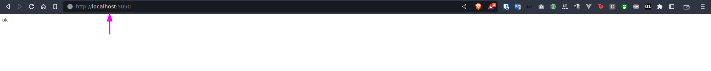

# Python Flask and PyMongo API

This is a Python application built with Flask and PyMongo that allows you to upload CSV files and store the data in a MongoDB database. The name of the collection will be a random UUID generated when you upload the file. You can then use the CRUD routes to manage the data in the collection.

# Requirements
1. Python 3
2. docker
3. docker-compose

# Setup
```sh
git clone https://github.com/stdioh321/python-crud-csv.git
cd python-crud-csv
```

# Run
```sh
docker-compose up
```
Should start 2 services, mongodb following of the application

Open your browser at: http://localhost:5050

# Routes
#### Error Response Object

For every route, if something goes wrong, the API will return the following error response object:

```json
{
  "display_message": "Friendly error message",
  "errors": [],
  "message": "Exception error message",
  "status_code": 404,
  "trace_string": "String Trace of the error"
}
```
### /api/csv
Handles the upload of the CSVs
#### POST /api/csv

Uploads a CSV file and creates a new MongoDB collection with a random UUID name.

- Returns 201 with `{"id": "collection_name"}` on success.
- Returns 500 if something went wrong.

#### PUT /api/csv/<collection_name>

Uploads a CSV file, clears the specified collection, and inserts the data from the CSV.

- Returns 200 with `{"id": collection_name, "count": <total items inserted>}` on success.
- Returns 404 if the specified collection is not found.
- Returns 500 if something went wrong.

### /api/collection
Handles CRUD of the collections
#### GET /api/collection/<collection_name>?field1=value1&field2=value2

Returns JSON data from the specified collection filtered by the query parameters. All parameters are optional, and the fields and values depend on the collection.

- Returns 200 with `[{_id: "objectId", ...dynamic data}]` on success.
- Returns 404 if the specified collection is not found.
- Returns 500 if something went wrong.

#### POST /api/collection/<collection_name>

Inserts a new document into the specified collection.

- Returns 201 with `{_id: "objectId", field1:value1, ...}` on success.
- Returns 404 if the specified collection is not found.
- Returns 500 if something went wrong.

#### PUT or PATCH /api/collection/<collection_name>?field1=value1&field2=value2

Updates documents in the specified collection that match the query parameters.

- Returns 200 with `{count: "total items updated"}` on success.
- Returns 404 if the specified collection is not found.
- Returns 500 if something went wrong.

#### DELETE /api/collection/<collection_name>?field1=value1&field2=value2

Deletes documents from the specified collection that match the query parameters.

- Returns 200 with `{count: "total items deleted"}` on success.
- Returns 404 if the specified collection is not found.
- Returns 500 if something went wrong.